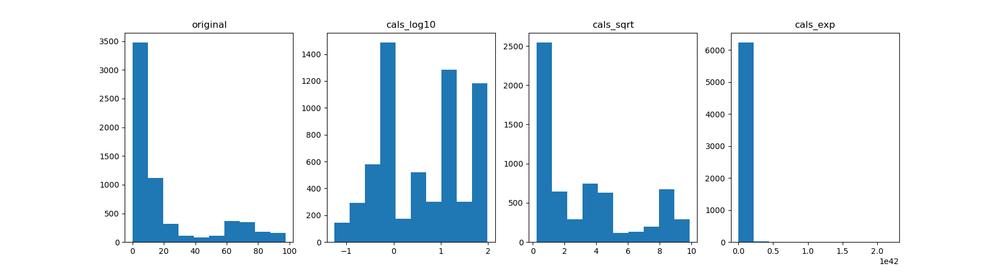
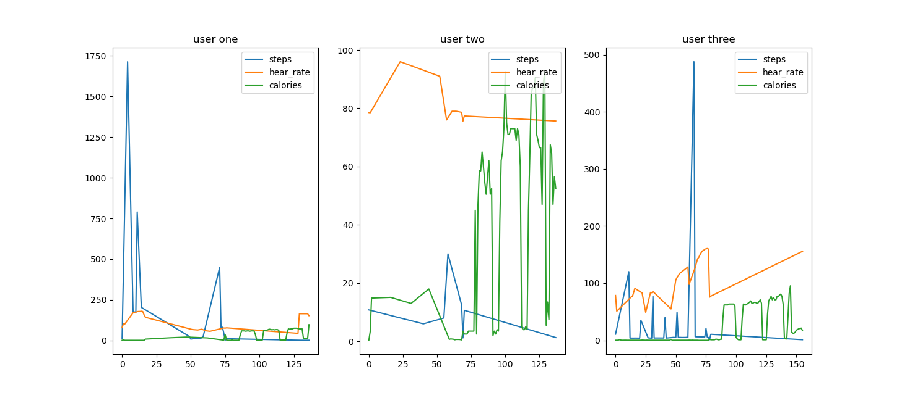

# Lab 2
___
# A2.1 - Temperature Logging and Collection
[Data here](./data/temperature_float.csv)

Noisy, unfiltered data.

# A2.2 - Motion Logging
[Data here](./data/move.csv)

Data before compression

Data after compression, all columns with values between -200 and 200 have been dropped.

# A2.3 - Frozen! 

Full data plotted.

Zoomed in, we can observe the changes per hour.

Processed data [here](./data/iot-temp-processed.csv)

# A2.4 - Digital Health

Since the data is exponential, maybe something of the form n^(x-m), where n < 1; m > 1, log or sqrt seems to work fine to bring some values on each column.

The instructions are a bit unclear, not sure there is a linear dependency between "number of participants of a given trait" and "trait" (eg, 2 people are 60 years old); I think histogram looks a bit better. No legend applies the way I did it.

Users and different traits visualized. Not all users have the same amount of entries

[Data here](./data/aw_fb_data-processed.csv)

# A2.5 - Gone with the Wind!
[Data here](./data/wind.csv)

